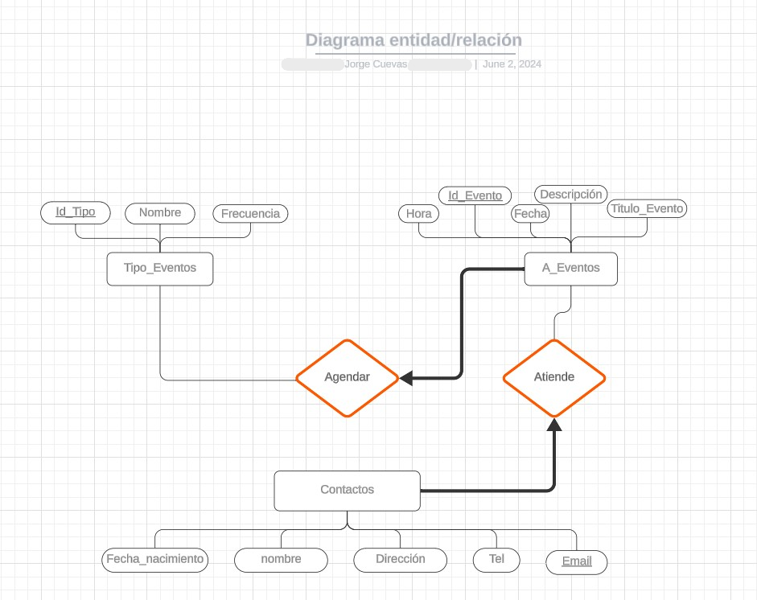

# PHP & PostgreSQL Event Calendar

A dynamic, web-based event calendar built with pure PHP, PostgreSQL, and the FullCalendar.js library. This project was developed to explore backend logic with a more robust database system, including advanced features like automated event creation through database triggers.


*(Note: This GIF showcases the main functionalities)*

## Project Overview

This application serves as a personal event manager. It allows users to manage contacts, define different types of events, and visualize them on an interactive monthly, weekly, or daily calendar. The project's main goal was to integrate a powerful JavaScript front-end library (FullCalendar) with a solid PHP backend connected to a PostgreSQL database.

A key aspect of this project was the use of modern tools for resource creation. **The interface icons were designed with the help of image generation from the following artificial intelligence models: Google and ChatGPT**
## Key Features

- **Interactive Calendar:** Utilizes **FullCalendar.js** to provide a responsive and user-friendly interface.
- **Contact Management:** Users can create and manage a list of contacts.
- **Event Type Management:** Ability to define custom event categories (e.g., 'Meeting', 'Appointment', 'Holiday').
- **CRUD Operations:** Full functionality to Create, Read, Update, and Delete events directly from the calendar interface.
- **Automated Birthday Events:** A **PostgreSQL trigger** automatically creates a recurring birthday event whenever a new contact with a birth date is added. 
---

## Tech Stack

- **Backend:** PHP
- **Database:** PostgreSQL
- **Frontend:** HTML, CSS, JavaScript
- **Core Library:** FullCalendar.js
- **Styling:** Bootstrap (for form views)

---
---

## Database Design

The data persistence layer is handled by a PostgreSQL database. The structure was designed to be relational and efficient, ensuring data integrity through primary and foreign keys.

The core design is illustrated in the following Entity-Relationship Diagram (ERD):



The design is centered around three main entities:
- **`T_eventos`**: Defines the different categories of events (e.g., 'Birthday', 'Meeting').
- **`Contactos`**: Stores user contact information.
- **`A_Eventos` (implemented as `Eventos` in the code)**: The main entity that connects an event type with a contact at a specific date and time.

A key feature, the automated creation of birthday events, is managed by a `TRIGGER` at the database level, which is defined in the `schema.sql` file. This design ensures that business logic related to data integrity is handled robustly by the database itself.

---
## Local Setup & Installation

To run this project on your local machine, you will need a local server environment with PHP and PostgreSQL installed.

1.  **Clone the Repository:**
    ```bash
    git clone https://github.com/Jorge-Cuevas90003/University-Calendar-Project.git
    cd University-Calendar-Project

    ```

2.  **Database Setup:**
    - Ensure your PostgreSQL server is running.
    - Create a new database. You can name it `Proyecto1`.
      ```sql
      -- Example using psql
      CREATE DATABASE "Proyecto1" WITH OWNER = postgres ENCODING = 'UTF8';
      ```
    - Connect to your new database and run the `schema.sql` script provided in this repository. This will create all the necessary tables, functions, and triggers.
      ```bash
      psql -U postgres -d Proyecto1 -f schema.sql
      ```

3.  **Configuration File (Crucial Step):**
    - In the project's root directory, create a new file named `config.php`.
    - Add your local PostgreSQL connection credentials to this file:
      ```php
      <?php
      // config.php - PostgreSQL Database Credentials
      define('DB_HOST', 'localhost');
      define('DB_PORT', '****');
      define('DB_NAME', 'Proyecto1');
      define('DB_USER', '*****');
      define('DB_PASSWORD', 'your_password'); // Add your local DB password here
      ?>
      ```

4.  **Run the Application:**
    - Place the project folder inside your web server's root directory (e.g., `htdocs` for XAMPP).
    - Open your web browser and navigate to `http://localhost/University-Calendar-Project/`.

---


As a learning project, there are several areas for future improvement.
## Author

- **Jorge Cuevas**
  - GitHub: [@Jorge-Cuevas90003](https://github.com/Jorge-Cuevas90003)
